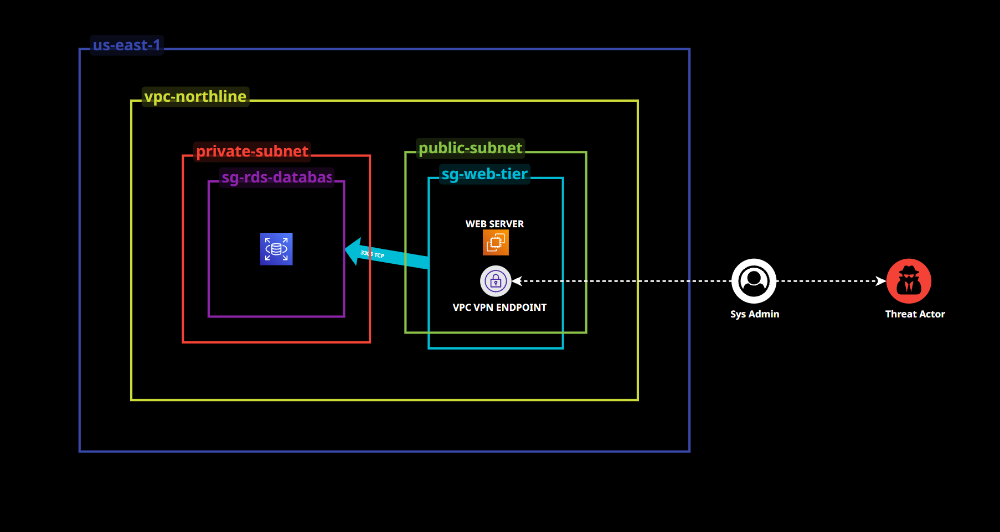

# hipaa-pci-breach-simulation
Simulated HIPAA/PCI breach lab: OSINT and phishing on a remote sysadmin yield VPN credentials, then lateral movement across a flat VPC into a private SQL subnet holding PII and card data. Covers attacker path, missed detections, and remediation.
## Table Of Contents 
### - [1. Scenario & Scope](#1-scenario--scope)
### - [2. Environment Architecture](#2-environment-architecture)

### - [3. Exposure Points & Remediation](#3-exposure-points--remediation)
### - [4. Compliance Mapping - HIPAA & PCI DSS](#4-compliance-mapping--hipaa--pci-dss)
### - [5. Cost of the Lab](#5-cost-of-the-lab)
---

## 1. Scenario & Scope

### Scenario

Northline Health is a fictional mid-sized healthcare provider running its
patient portal and billing systems in AWS. The environment stores ePHI alongside stored cardholder data.

A threat actor targets Northline with the goal of exfiltrating both data sets.
Rather than attacking the perimeter, the actor targets a person: a remote
system administrator with a heavily exposed public social media presence. Open
source research yields the administrator's employer, role, daily
responsibilities, work and personal email addresses, approximate location, and
a documented interest in browser extensions that find retail discounts.

That last detail becomes the lure. A phishing email offers a coupon-scraping
extension. The administrator installs it. The extension carries remote access
tooling that harvests stored VPN credentials.

From there the attack is entirely a network design problem. The credentials
grant access to a public subnet. The VPC's local route and permissive security
groups allow that access to reach a private subnet hosting a RDS database.
The actor queries the database using a credential that legitimately holds
read access, and exfiltrates patient and cardholder records.

Every relevant log source was enabled. Nothing alerted.

### Scope

This lab was built in an isolated AWS account owned by myselfr. All data in
the target database is synthetic and generated for this project. No real PHI
or cardholder data was used at any point.

The OSINT and phishing stages are documented as narrative only. No real
individual was targeted, no malware was written, and no email was sent. The
technical lab begins at the point where an attacker holds valid VPN
credentials, which is the first stage that produces observable evidence in
AWS logs.

**In scope:** VPC and subnet design, security group and NACL configuration,
VPN access, RDS database access, CloudTrail and VPC flow log analysis,
detection logic, and remediation delivered as Terraform.

**Out of scope:** endpoint security controls, email gateway filtering, and any
system outside the lab account

---

## 2. Environment Architecture

### Illustration of scenario's architecture

Audio breakdown of of illustration can be found on via [Loom Profile](https://www.loom.com/share/103d19c24d2d4278ab12a023170fa846) and/or [Linkedin](https://www.linkedin.com/posts/trevor-gilchrist-45a94236b_cloudsecurity-aws-terraform-activity-7501836968461438977-gAWX?utm_source=share&utm_medium=member_desktop&rcm=ACoAAFvMMAYBwdbm2lJe9EDXleUG3jkZ_DvFFcc)
--

## 3. Exposure Points & Remediation

### Exposure points 
1. Overly Permissive RDS Security Group (CIDR Sourcing Instead of Security Group Sourcing)

2. Flat VPC — No Subnet Level Segmentation (NACLs)

3. No Identity Based Detection Logic

4. Overly Broad Standing Database Access

5. VPN Authentication With No Session Level Controls

6. Unrestricted Egress on Compute and Database Tiers

### Remediation